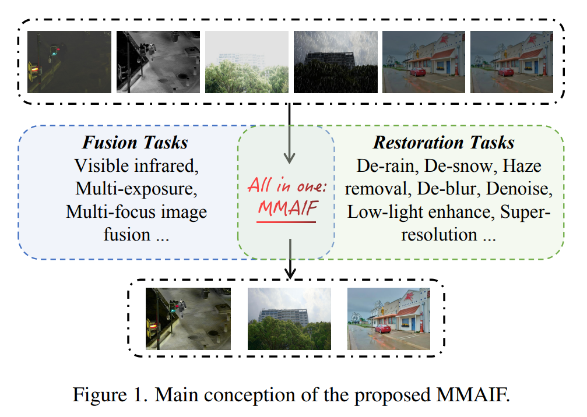
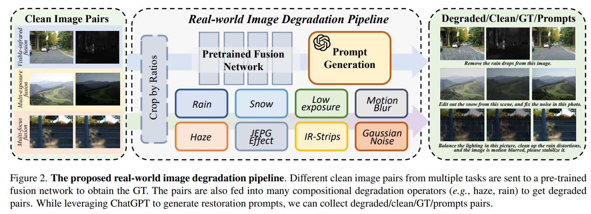
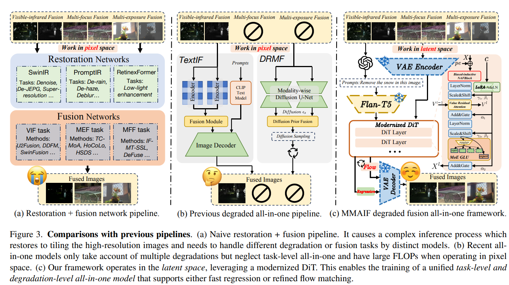
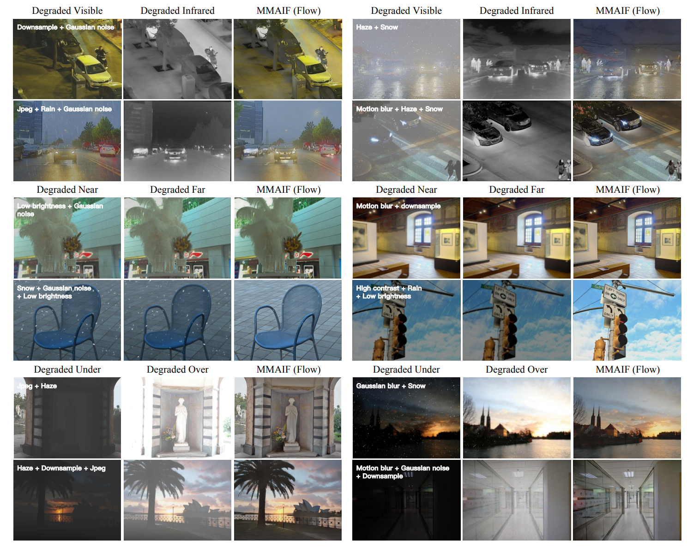

<h1 style="text-align: center;">MMAIF: Multi-task and Multi-degradation All-in-One for Image Fusion with Language Guidance</h1>

  <a href=https://scholar.google.com/citations?user=pv61p_EAAAAJ&hl=en>Zihan Cao </a> | Yu Zhong | Ziqi Wang | Jiang-Jian Deng</>
  <a>University of Science and Technology of China</a>

paper: 

# Quick Introduction

<figure style="text-align: center; width: 100%;">
  
  <figcaption>Fig 1: MMAIF framework overview.</figcaption>
</figure>

<strong>Abstract</strong>:
Image fusion, a fundamental low-level vision task, aims to integrate multiple image sequences into a single output while preserving as much information as possible from the input. However, existing methods face several significant limitations: 1) requiring task- or dataset-specific models; 1) neglecting real-world image degradations (e.g., noise),
which causes failure when processing degraded inputs; 3) operating in pixel space, where attention mechanisms are computationally expensive; and 4) lacking user interaction capabilities. To address these challenges, we propose a unified framework for multi-task, multi-degradation, and language-guided image fusion. Our framework includes two key components: 1) a practical degradation pipeline that simulates real-world image degradations and generates interactive prompts to guide the model; 2) an all-in-one Diffusion Transformer (DiT) operating in latent space, which fuses a clean image conditioned on both the degraded inputs and the generated prompts. Furthermore, we introduce principled modifications to the original DiT architecture to better suit the fusion task. Based on this framework, we develop two versions of the model: Regression-based and Flow Matching-based variants. Extensive qualitative and quantitative experiments demonstrate that our approach effectively addresses the aforementioned limitations and outperforms previous restoration+fusion and all-in-one pipelines.

We provide a effecient data synthesis pipeline to generate degradation pairs.

<figure style="text-align: center;">

<figcaption>Fig. 2: Data synthetic pipeline overview.</figcaption>
</figure>

Based on the pipeline, we generate around 10k image pairs for training, including various degradation scenarios including *rain, snow, haze, motion blur, JPEG compression, and Gaussian noise, etc.*, as well as, commom image fusion tasks including multi-exposure, multi-focus, and visible-infrared image fusion.

We train two versions of models:
- Regression-based model
- Flow matching model

with **MoE** architecture and work in latent space,
which is *fast and efficient*.

Our model can suit for multiple image fusion tasks and different degradations, **only in one model**.

<figure style="text-align: center;">

<figcaption>Fig. 3: Model comparision overview.</figcaption>
</figure>

Here are some visual results of our model and restoration+fusion methods.****

<figure style="text-align: center;">

<figcaption>Fig. 4: Visual comparisons.</figcaption>
</figure>

## Code Will be Released Soon! Stay Tuned for Updates.